# Arcane Style Transfer 

> 23Spring 重庆大学计算机学院 深度学习课程项目-任务6

<div align=center>
    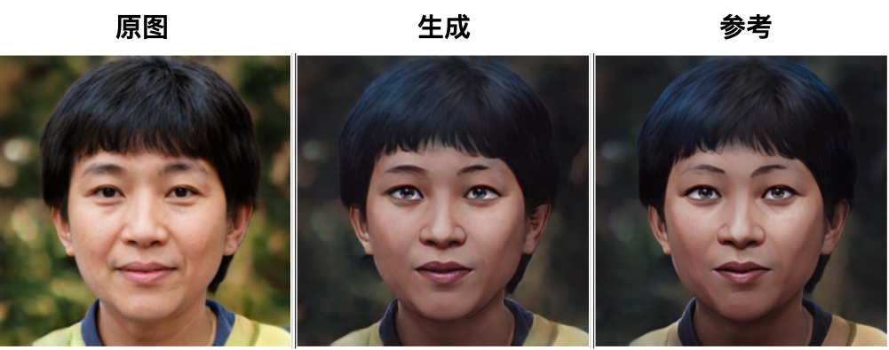
</div>

## 项目简介
双城之战主角金克斯有句台词是“我有最美好的初衷”奈何却总是好心办了“坏事”。而希尔科最初因为与范德尔选择了不同的道路而决裂了，但到最后的时候希尔科却越来越像范德尔。希尔科最后对金克斯说的“你，我什么都不换”更是让无数玩家泪崩。出于对双城之战画风的喜爱，本项目将利用生成对抗网络(GAN)实现双城之战动画进行风格迁移。

## 项目结构
```
├── imgs # 实验结果
├── README.md
├── pytorch-CycleGAN-and-pix2pix # Pix2Pix&CyleGAN
│   ├── datasets
│   ├── ...
├── UGATIT-pytorch # UGATIT
│   ├── datasets
│   ├── ...
├── metrics.py # 评价指标
```

## 基础版-CycleGAN
> !TODO: 补充原理

## 基础版-Pix2Pix
> !TODO: 补充原理

## 进阶版-UGATIT
> !TODO: 补充原理


## 评价指标
实验中使用了三个评价指标，分别是**FID**、**LPIPS**和**MS-SSIM**。其中FID和LPIPS越小越好，MS-SSIM越大越好。

**FID**为*Fréchet Inception Distance*的缩写，是一种用于评估图像生成模型的指标。它是基于Inception-v3模型提取的特征来计算的，可以用来衡量生成图像与真实图像之间的相似度。FID越小，说明生成图像与真实图像越相似。

**LPIPS**为*Learned Perceptual Image Patch Similarity*的缩写，是一种用于评估图像生成模型的指标。它是基于VGG-16模型提取的特征来计算的，可以用来衡量生成图像与真实图像之间的相似度。LPIPS越小，说明生成图像与真实图像越相似。

**MS-SSIM**为*Multi-Scale Structural Similarity*的缩写，是一种用于评估图像生成模型的指标。它是基于人眼视觉系统的特性来计算的，可以用来衡量生成图像与真实图像之间的相似度。MS-SSIM越大，说明生成图像与真实图像越相似。

| 模型 | FID $\downarrow$ | LPIPS $\downarrow$ | MS-SSIM $\uparrow$ |
| :----: | :----: | :----: | :----: |
| **CycleGAN** | 98.01 | 0.2939 | **0.9051** |
| **U-GAT-IT** | 103.00 | 0.3372 | 0.8562 |
| **Pix2Pix** | **85.16** | **0.2414** | 0.8711 |

## 实验结果
不同模型的结果对比如下图所示
| 原图 | Pix2Pix | U-GAT-IT | CycleGAN | Reference |
| :----: | :----: | :----: | :----: | :----: |
| 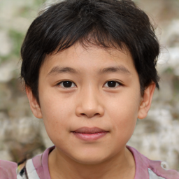 | 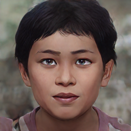 | 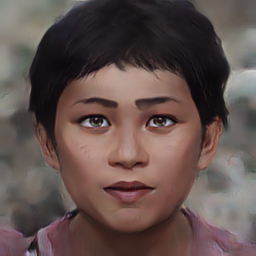 | 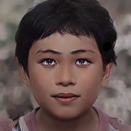 | 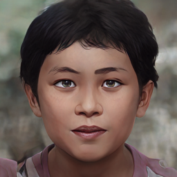 |
| 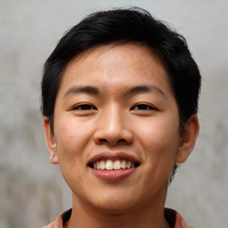 | 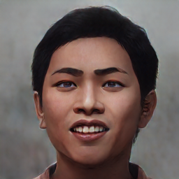 | 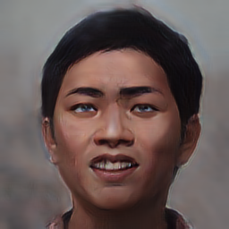 | 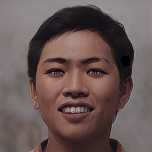 | 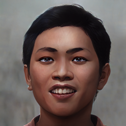 |
| 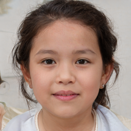 | 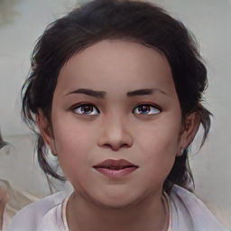 | 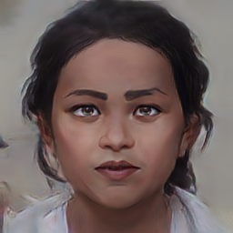 | 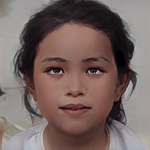 | 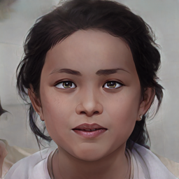 |
| 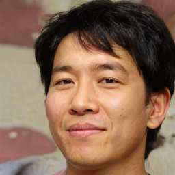 | 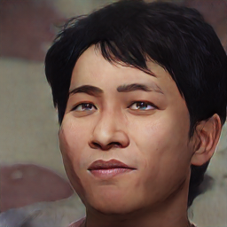 | 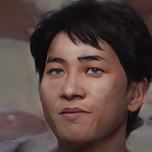 | 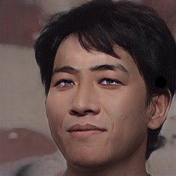 | 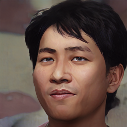 |

## 参考资料
- [1] [Image-to-image translation with conditional adversarial networks](https://arxiv.org/abs/1611.07004)
- [2] [U-GAT-IT: Unsupervised Generative Attentional Networks with Adaptive Layer-Instance Normalization for Image-to-Image Translation](https://arxiv.org/abs/1907.10830)
- [3] [Unpaired Image-to-Image Translation using Cycle-Consistent Adversarial Networks](https://arxiv.org/abs/1703.10593)
- [4] Github Official Code：[Pix2Pix&CyleGAN](https://github.com/junyanz/pytorch-CycleGAN-and-pix2pix)
- [5] Github Official Code：[U-GAT-IT](https://github.com/znxlwm/UGATIT-pytorch)